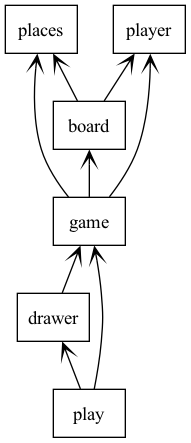

# Application for "Ciutats i Camins" game

This project lies in the implementation of an application for the strategy game named "Ciutats i Camins" which is based on the well-known board game Catan™️.

The game is carried out on a rectangular board divided into cells that contain resources which, under certain conditions, can be progressively collected with the objective of turning them into money to build cities and paths.

The game advances through various turns, during which players collect resources and have the option to either create paths or build and destroy cities, as long as conditions allow it.
The winner is the player with more money at the end of the game. In case of a tie, the victory goes to the player with the highest ID number among those who are tied in terms of money. 

So, the aim of the project is to execute a simulation of the game through the development of different modules that manage each part of it, in order to provide an interactive platform where users will put a strain on their strategy abilities. 

## Project structure and implementation

The project is organized in several modules that manage each part of the game. 

### Play Module

The 'play' module contains the main program that arranges the execution of the game simulation. 
Internally, this module initializes the game environment which includes setting up the game board, initializing player objects and configuring each needed parameter.

### Drawer Module

The 'drawer' module is in charge of the game elements' rendering using the Pygame library. It visually represents the game state to the user, which includes the game board illustration, players' paths, cities and other relevant information.

### Game Module

The 'game' module is the core of the project. It encapsulates the logic of the game's progression, processing the players' movements and actions, as well as updating the game state. 
In order to achieve this, 'board', 'player', and 'places' modules are also involved.

Internally, it operates with a loop that iterates through turns, each corresponding to a single player that changes with each iteration, until the game reaches an specific turn limit, denoting the end of the game and announcing the winner.

Each turn involves two main steps: resource collection and player action.
Resource collection is crucial for each turn; it depends on the player's cities and the availability of resources in the cells on the board game surrounding them. After this, the module makes a cash update accordingly.

If conditions are met, players can take an action, such as constructing a path or building/destroying a city. However, if a player attempts an action that violates the game rules, an error message is displayed, and the turn is automatically passed without making any changes to the game state. 

In contrast, if a player completes a valid action, the module updates the game state accordingly, and changes are reflected on the game board.

When it reaches the turn limit, a message is displayed annonuncing the winner of the game, and the Pygame exits.

### Board Module

The 'board' module manages the tasks related to the game board.

This includes initializing the game with a specified size and initial resources' distribution. 
Additionally, it enables the integration of paths and the addition and removal of cities.
Furthermore, it updates and keeps track of the resources in each cell of the board, ensuring that the players' movements can properly interact with the game environment.

### Places Module

The 'places' module is a fundamental component for helping with readability and efficiently managing locations and paths throughout the code. It defines key elements to represent the game, which include: 'BoxSize', 'Coord' and 'Path'.

'BoxSize' represents the size of the game board as a tuple that specifies its height and width. 'Coord' is used to represent coordinates on the game board, enabling the precise location of cities and cells for resources. 'Path' symbolizes a path defined as a tuple of two 'Coord' representing the origin and end points of it.

### Player Module

The 'player' module is where individual players' information is stored. It encapsulates an assigned unique identification number, the cash balance and an identification color.

Each player is initialized with a number that corresponds to the order their information input, a uniform initial cash amount and a color which is used to identify them on the game board. The module facilitates the cash balance update during each player's turn. 

This module increases the efficiency in managing player-related information along the game. 

## Instructions for use

To initialize the game, the input must follow a specific format and ordering.

**Things to take into consideration:** 

- Turn Management
The number of turns must be a positive integer. As soon as the game is initialized, the variable that keeps track of the current turn starts at number 1, and its value must not exceed the total number of turns specified. 

- Action Cost
The price to carry out any action (path building, city building or destruction) is a positive integer. 

- Initial cash
The initial cash assigned can be any integer value. If it is negative, it simply indicates a negative starting balance. Regardless of the initial cash, players can still participate in the game.

- Maximum City Building
Since the game starts with one city per player, the maximum number of cities that can be built, must be a positive integer. 

- Board Size
The size of the game board has to be defined with positive integers for both height and width coordinates.

- Resource Distribution
Can be positive or negative values, as they do not affect the game's functionality. 

- Number of players
The number of players has to be a positive integer, as this determines the number of people who take part in the game. 

**Game instructions**

Established game rules must be followed in order to collect resources or take any action. If a player does not follow a rule, nothing will be done, and an error message will be displayed, indicating that the player loses the turn.

In terms of actions format, each action has its specific one:
  - 'build_path' 'current_player_num' 'Path'
  - 'build_city' 'current_player_num' 'Coord'
  - 'destroy_city' 'current_player_num' 'Coord' 

## Game Tests

Several game tests have been designed to systematically evaluate various aspects and functionalities of the game in order to identify and address potential issues. Each of them is focussed on several aspects.

**Test 1**
- Verify city coordinates can be located on the game board, even if they are in the game board frame
- Confirm that the initial cash can be any integer number
- Confirm path coordinates are valid according to player territories

**Test 2**
- Check for negative initial resources
- Check for negative initial cash
- Ensure enough money is available to build a path or city

**Test 3**
- Verify correct initial input: non-negative number of columns for the board

**Test 4**
- Path validation according to its length (module = 1)
- Validate the path construction in terms of coordinates. Ensure that none of the nodes are connected to another player's path, except if there is a city (cities promote exchange)  
- Ensure city is not built on an occupied location

**Test 5**
- Verify correct input: action corresponds to the current player's ID 
- Verify correct input: the action exists

**Test 6**
- Confirm initial cities are located on the game board 

**Test 7**
- Check the maximum number of cities a player can build
- Confirm that cells can have any amount of initial resources

**Test 8**
- Check that city destruction cannot be carried out if the coordinates given do not belong to the corresponding player 
- Validate path construction with both endpoints on the game board

**Test 9**
- Confirm that cells can have any amount of initial resources
- Check for any initial cash 

**Test 10**
- Validate path construction with any endpoint joint to another path that does not belong to the corresponding player  

## Possible improvements

There are several improvements that could be accomplished with additional time and knowledge. Here are some ideas for future enhancements:

- User Interface
Modify 'play' and 'drawer' modules in order to improve the interface, making it more visually appealing and easy to interpret. Some of these changes would involve adding animations, as well as sound effects to enhance interactivity.

- Algorithm optimization
Algorithm optimization would be the key to improving the efficiency and performance of the algorithms used. This would play an important role in reducing execution time, memory usage and resources requirements.
Due to the large number of conditions and rules, it has been a challenging task, but with deeper knowledge and experience, more effective and efficient solutions could be implemented. 

## Project requirements

In order to guarantee the correct execution of the project, it relies on several components.

- Python Language
The project is implemented making use of the Python language.

- Pygame
Pygame is a cross-platform set of Python modules that, in this project, is used for visualizing the game's development. 

- Internal modules
The project uses internal modules: 'game', 'board', 'places', and 'player', that have been implemented for the game logic and functionality.

## Input reading instructions

- Unix-based Systems (Linux, macOS):
  *'python3 play.py < file.inp'*

- Windows PowerShell:
  *Get-Content file.inp | python3 play.py*
  
- Windows Command Prompt:
  *python3 play.py < file.inp*

